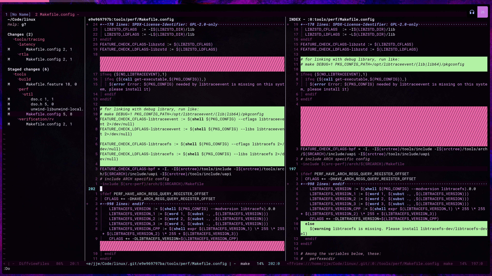

## dotfiles

Originally based on [Elenapan's dotfiles](https://github.com/elenapan/dotfiles).

Contents:

- AwesomeWM config: taken nearly verbatim from Elenapan. Just... don't look at the code. I commented out the parts I didn't want and used some other messy techniques to change the looks where I wanted something different. Given I'm the only one using and writing the code, the mess is permitted, but you shouldn't copy it over. :P
- Nvim config: Lives in a [separate repository](https://github.com/JJWRoeloffs/nvim-config).
- Zsh config: A fairly minimal zsh config with the pure prompt and a few zinit plugins. Nothing special. I mostly keep it in source control because of the sheer amount of things I need to add to my PATH.
- Alacritty config: Fancy colours, thrown together from a few different colour schemes.
- Rofi config: Custom config to match my Alacritty colour scheme and its rounded corners.
- .vimrc: Sometimes, you don't need nvim
- redshift/htop: Here more for the install script than anything else.

At some point in the future, I plan to move away from X11 and, with that, awesomeWM. However, that day is not today, as I still need X11-only software that doesn't seem to like xwayland. Academic software is always the best. :P

### Screenshots

 

 

### Installing

There is an install script at `install.sh` that worked perfectly for me on Debian 12 when I wrote it. However, I am not keeping it updated or considering edge cases irrelevant to me, so your mileage may vary. It's just there such that I could install my system on a few different machines.

As I'm the only one using this and the code is not clean, it working on any machine other than my own is entirely accidental. Instead of using my config, please enjoy this image of a cat:

 

